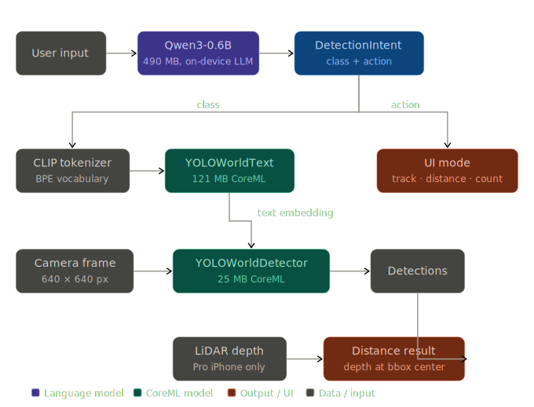

# YOLO-World iOS — Real-Time Open-Vocabulary Object Detection with CoreML & LiDAR

Real-time open-vocabulary object detection on iOS, powered by [YOLO-World](https://github.com/AILab-CVC/YOLO-World), on-device CLIP inference, LiDAR depth sensing, and a local LLM for natural language understanding. Runs fully offline.

Type "how far is that chair" and the app detects chairs in the camera feed, measures the distance via LiDAR, and shows it on screen -- no server, no API key, no predefined vocabulary.

## Features

- **Open-vocabulary detection** -- type any object name and detect it in real time. No fixed class list; the CLIP text encoder runs on-device to generate embeddings for arbitrary text.
- **Natural language input** -- an on-device LLM (Qwen3-0.6B) parses freeform queries like "how many bottles are there?" into structured intents.
- **LiDAR distance measurement** -- samples depth at detected object centers on Pro iPhones with LiDAR.
- **Three interaction modes:**
  - **Track** -- "find dogs" -- bounding boxes only
  - **Distance** -- "how far is that person" -- distance overlay
  - **Count** -- "how many chairs" -- count overlay

## Architecture



**Models:**

| Model | Size | Runs | Purpose |
|-------|------|------|---------|
| `YOLOWorldDetector.mlpackage` | 25 MB | Every frame | Object detection backbone |
| `YOLOWorldText.mlpackage` | 121 MB | On text input | CLIP text encoder |
| Qwen3-0.6B Q4_K_M | 490 MB | On text submit | Natural language parsing |

The detector and text encoder are exported from YOLOv8s-World-v2 using `export_for_ios.py`. The Qwen3 model is downloaded from HuggingFace on first launch.

## Requirements

- iOS 17.0+
- iPhone with A14 chip or later
- LiDAR sensor for distance mode (iPhone 12 Pro and later Pro models)
- Xcode 16+
- [XcodeGen](https://github.com/yonaskolb/XcodeGen)

## Setup

```bash
# 1. Clone
git clone https://github.com/user/yolo-world-ios.git
cd yolo-world-ios

# 2. Generate the CoreML models (requires Python)
pip install ultralytics>=8.3 coremltools>=7.2 torch clip
python export_for_ios.py

# 3. Generate the Xcode project
brew install xcodegen   # if not installed
xcodegen generate

# 4. Open in Xcode, let SPM resolve LLM.swift, build & run on device
open YOLOWorldApp.xcodeproj
```

The Qwen3 LLM (~490 MB) downloads automatically on first launch. Subsequent launches use the cached model.

## Project Structure

```
YOLOWorldApp/Sources/
  YOLOWorldApp.swift        App entry point
  ContentView.swift         Main UI -- camera, text input, distance/count overlay
  ObjectDetector.swift      Camera capture, CoreML inference, LiDAR depth sampling
  CameraPreviewView.swift   UIViewRepresentable for AVCaptureVideoPreviewLayer
  DetectionOverlay.swift    Bounding box drawing
  CLIPTokenizer.swift       BPE tokenizer for CLIP text encoder
  IntentParser.swift        On-device LLM intent extraction
  DetectionIntent.swift     Intent data model (class + action enum)

export_for_ios.py           Exports YOLO-World to open-vocab CoreML (detector + text encoder)
train.py                    Re-export with updated vocabulary (legacy fixed-vocab mode)
project.yml                 XcodeGen project spec
clip_tokenizer.json         CLIP BPE vocabulary (generated by export script)
```

## How It Works

### Open-Vocabulary Detection

Standard YOLO-World bakes text embeddings as constants during export, locking the model to a fixed vocabulary. This project splits the model into two parts:

1. **YOLOWorldText** -- the CLIP text encoder, exported separately as CoreML. Converts any word into a 512-dimensional embedding on-device.
2. **YOLOWorldDetector** -- the detection backbone, modified to accept a text embedding tensor as input instead of frozen constants.

When the user types a new word, only the text encoder runs (~10ms). The detector keeps running every frame with the cached embedding. No model reload, no re-export.

### LLM Intent Parsing

The on-device Qwen3-0.6B model extracts structured intent from natural language:

```
"how far is that person" → { class: "person", action: "distance" }
"count the bottles"      → { class: "bottle", action: "count" }
"find dogs"              → { class: "dog",    action: "track" }
```

This runs in ~100-200ms after model warm-up.

## License

MIT

Built by [Alex Culeva](https://alexculeva.com) — ARKit & computer vision specialist.
